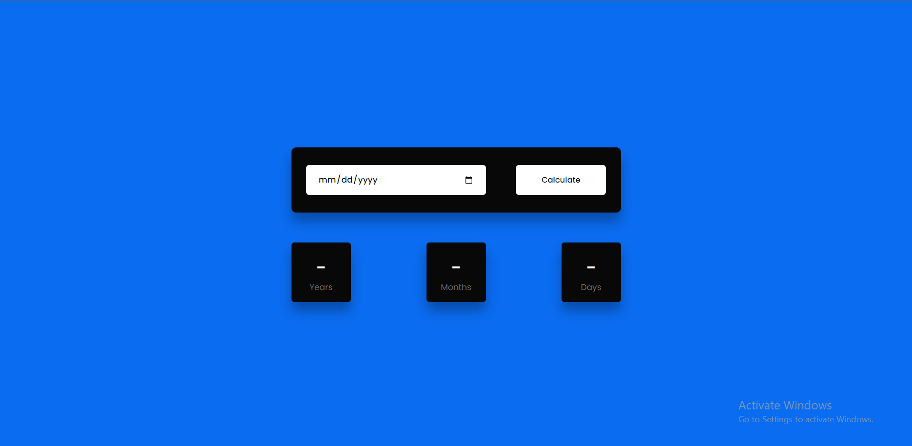

<h1 align="center">
  Age Calculator
</h1>

<h3 align="center">
  Javascript Project
</h3>

  

The Age Calculator repository using HTML, CSS, and JavaScript is a web-based tool that allows users to calculate their age based on their date of birth. The repository typically contains a source code file that includes an HTML file for the user interface, a CSS file for styling, and a JavaScript file for the age calculation. The HTML file typically includes input fields for the user to enter their birthdate, and a button to initiate the age calculation. The JavaScript file includes the logic for calculating the age based on the user input and displaying the result. The CSS file is used to style the user interface and make it more visually appealing. This tool can be used in a variety of web-based applications, such as age verification for registration or calculating the age of users for personalized content. 

  
<!-- ................................................................................................................................. -->

### Features
 
Following are some of the new features and learning encountered while creating this amazing project:

- Date input: An age calculator typically includes a user interface for entering the date of birth in a user-friendly format, such as a calendar widget or separate input fields for day, month, and year.

- Age calculation: Once the user enters their date of birth, the age calculator performs a calculation to determine the user's age based on the current date.

- Output display: The calculated age is typically displayed to the user in a user-friendly format.

- Error handling: The age calculator may include error handling to ensure that the user enters valid date information and to alert the user if there are any issues with the input or output.

  
<!-- ................................................................................................................................. -->

### Resources
 
Follwing resources have been used in maintaining this project:

- [Google Fonts](https://fonts.google.com/) to import the <b>Poppins</b> Family 

  
<!-- ................................................................................................................................. -->

### Demo

  The Demo of this working project can be found on  
  <a href="https://rebrand.ly/AgeCalculator_MABCORP">https://rebrand.ly/AgeCalculator_MABCORP</a>

  
<!-- ................................................................................................................................. -->

### Video

You can exclusively watch the video on this project from the making to deploying on my     channel with the link given below 

  [Video Link](# )  

  If you like my video then do Like the Video and share it with others.

  
<!-- ................................................................................................................................. -->

### Graphical User Interface

  
<!-- ................................................................................................................................. -->

### Technology Stack
 
Follwing technologies have been used at the core of this application to make it stand in the market place:

- HTML
- CSS
- JavaScript

  
<!-- ................................................................................................................................. -->

### Advancement

> Not Recommended Yet

  
<!-- ................................................................................................................................. -->

### Deployment Details

The website is deployed using the free hosting provided by **Vercel**

  

  
Later on the link was customized using the well-known URL shortener and customizer **Rebrandly**:  

  

  
<!-- ................................................................................................................................. -->

### Developer

Muhammad Abdullah Butt  
abdullahbutt12292210@gmail.com  
> [Instagram](https://www.instagram.com/abdullah.butt.22/) 
> [FaceBook](https://www.facebook.com/profile.php?id=100076291614529) 
> [YouTube](https://www.youtube.com/channel/UCnuOFQyMywg-KuoN-lmav1Q) 
> [Portfolio](https://rebrand.ly/MuhammadAbdullahButt_MABCORP) 
> [Project Displayer]( https://rebrand.ly/ProjectDisplayer_MABCORP)
  
<!-- ................................................................................................................................. -->

